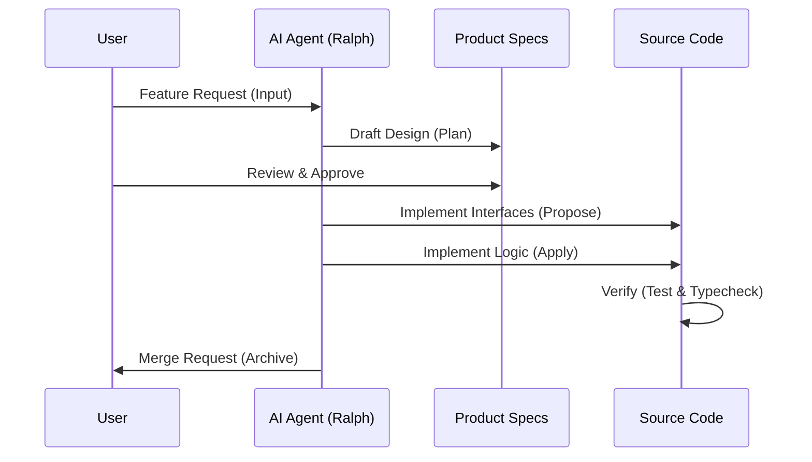
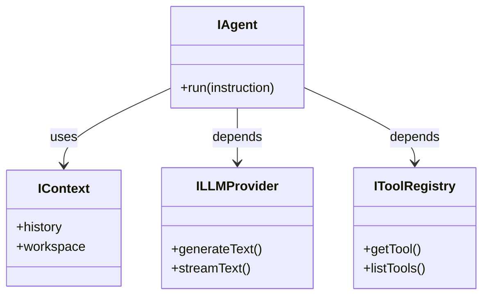

# aicoding: Vibe Coding Playground

> **[English](README.md) | [中文说明](README_zh-CN.md)**

Welcome to `aicoding`, an experimental project dedicated to exploring and mastering **Vibe Coding** techniques using advanced AI Agent collaboration.

## What is Vibe Coding?

Vibe Coding is a philosophy where developers collaborate with autonomous AI agents to build software at the speed of thought. It emphasizes:
- **Interface-First Design**: Define contracts, let AI handle implementation.
- **Agentic Workflows**: Use structured loops (like Ralph Loop) for complex tasks.
- **Verification**: Trust but verify through rigorous testing artifacts.

## Architecture

The system is built on a clear separation of concerns, driven by the **Ralph Loop** workflow.

### 1. The Ralph Loop (Workflow)

### 2. Core Agent Structure

The agent core follows the **Interface Segregation Principle (ISP)**.

For a deep dive into the system design, please refer to:
- [Architecture Documentation](docs/ARCHITECTURE.md)
- [Vibe Coding Guide](.ai/VIBE_CODING_GUIDE.md)

## Key Features

- **Terminal Tool**: A secure, confirm-first terminal execution environment.
- **Agent Core**: TypeScript-based agent logic adhering to ISP (Interface Segregation Principle).
- **Skill System**: Modular skills (PRD, Ralph) to extend agent capabilities.

## Getting Started

1.  Clone the repository.
2.  Install dependencies: `npm install`.
3.  Start the agent environment: `npm start`.

## License

ISC
