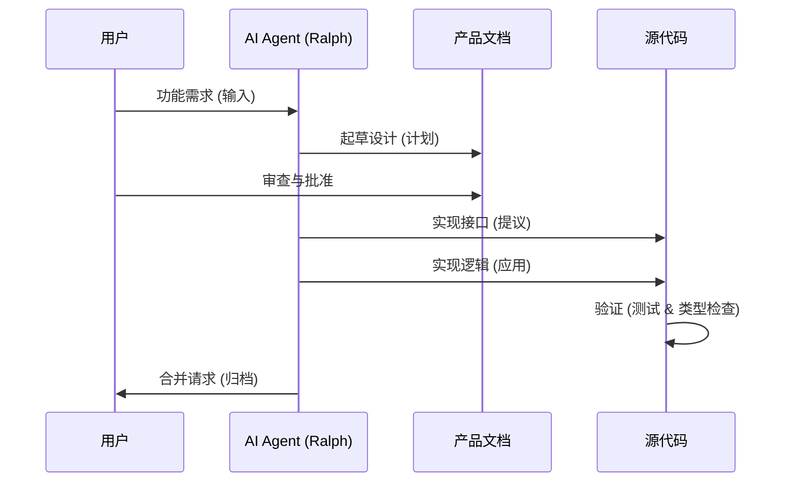
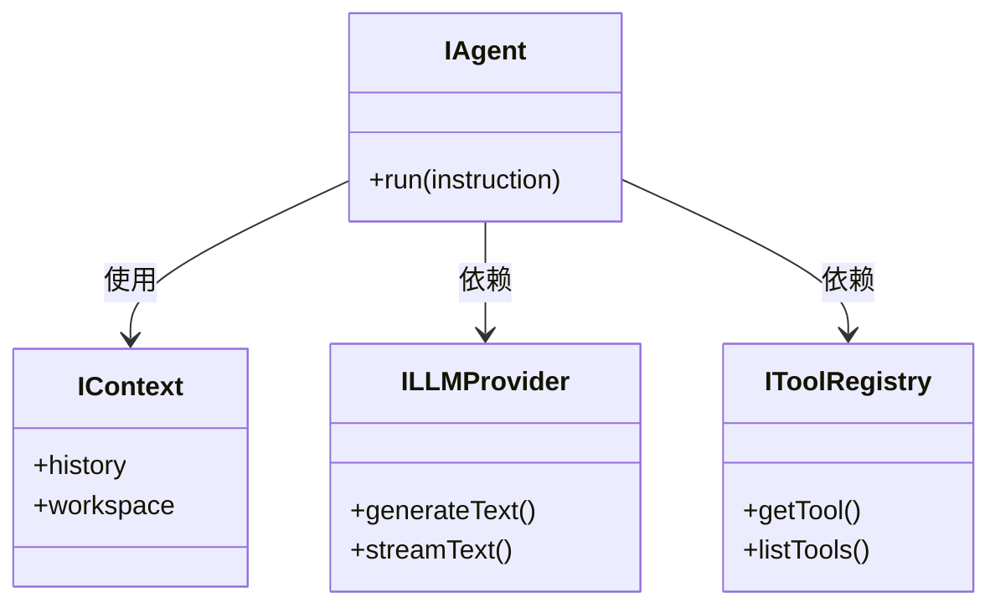

# aicoding: Vibe Coding 实验场

> **[English](README.md) | [中文说明](README_zh-CN.md)**

欢迎来到 `aicoding`，这是一个致力于探索和掌握 **Vibe Coding** 技术以及高级 AI Agent 协作模式的实验性项目。

## 什么是 Vibe Coding?

Vibe Coding 是一种开发哲学，强调开发者与自主 AI Agent 深度协作，以思维的速度构建软件。它核心关注：
- **接口优先 (Interface-First)**: 定义契约，让 AI 负责具体实现。
- **Agent 工作流**: 使用结构化循环（如 Ralph Loop）处理复杂任务。
- **验证机制**: 严格通过测试产物来验证 AI 的工作成果。

## 系统架构

本项目建立在清晰的关注点分离之上，由 **Ralph Loop** 工作流驱动。

### 1. Ralph 循环 (开发流)

### 2. Agent 核心结构

Agent 核心遵循 **接口隔离原则 (ISP)**.

如需深入了解系统设计，请参阅:
- [架构文档](docs/ARCHITECTURE_zh-CN.md)
- [Vibe Coding 指南](.ai/VIBE_CODING_GUIDE.md)

## 主要功能

- **终端工具 (Terminal Tool)**: 安全的、基于确认机制的终端执行环境。
- **Agent 核心**: 遵循接口隔离原则 (ISP) 的 TypeScript Agent 逻辑。
- **技能系统 (Skill System)**: 模块化的技能扩展 (如 PRD 生成, Ralph 转换)。

## 快速开始

1.  克隆仓库。
2.  安装依赖: `npm install`.
3.  启动 Agent 环境: `npm start`.

## 许可证

ISC
