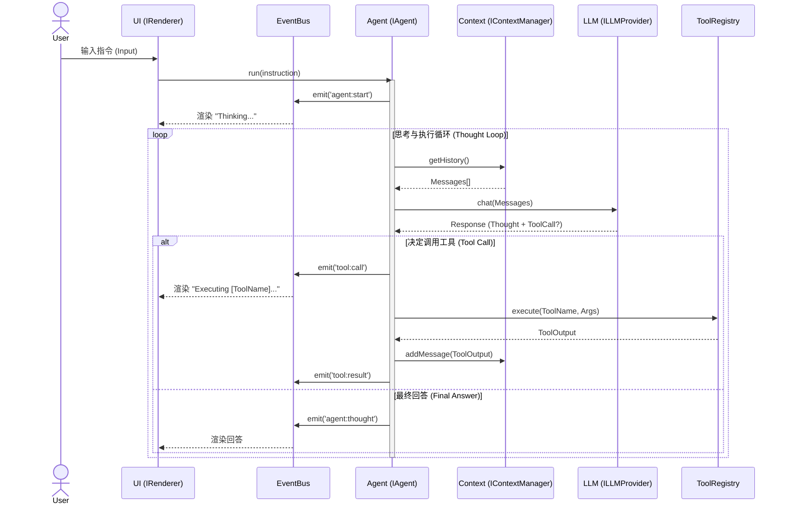

# 架构设计文档 (Architecture Design)

## 1. 核心理念 (Core Philosophy)
本项目 `aicoding` 旨在构建一个高度解耦、即插即用的终端 AI 编程智能体。
每一行代码都应遵循 **依赖倒置原则 (DIP)** 和 **接口隔离原则 (ISP)**。

### C/S 架构理念 (Client/Server Mentality)
尽管这是个本地 CLI 工具，我们在模块设计上采用 C/S 隐喻：
- **Client (UI Layer)**: `src/ui`. 负责渲染和接收输入，不含任何业务逻辑。它通过 `EventBus` 订阅状态变化。
- **Server (Core Layer)**: `src/agent`. 负责大脑思考、循环调度。它不知道 UI 是控制台还是 Web 页。
- **Infrastructure (Infra Layer)**: `src/llm`, `src/tools`, `src/fs`. 具体的实现细节（如调用 OpenAI 或读写本地文件）。

## 2. 数据流与交互 (Data Flow)
用户输入被 UI 捕获后，传递给 Agent。Agent 不直接操作 DOM 或 Console，而是通过发射事件告知 UI 该显示什么。

## 3. 模块职责 (Module Responsibilities)

| 模块 | 核心接口 | 职责 | 依赖方向 |
| :--- | :--- | :--- | :--- |
| **Type Definitions** | `src/types/*.ts` | 定义契约。所有模块的指路明灯。 | 无依赖 (Base) |
| **Infrastructure** | `ILLMProvider`, `IWorkspace` | 实现具体的 IO 操作（如 OpenAI API, 文件读写）。 | 依赖 Types |
| **Logic Core** | `IAgent`, `IContextManager` | 业务逻辑的核心。编排 LLM 与工具及其状态。 | 依赖 Types (Interface only) |
| **Presentation** | `IRenderer` | 将内部事件转化为用户可读的 UI（CLI/TUI）。 | 依赖 Types, Events |

## 4. 扩展性设计 (Extensibility)
- **接入新模型**: 只需实现 `ILLMProvider`。
- **添加新工具**: 实现 `ITool` 接口并通过 `IToolRegistry.register()` 注册，Agent 会自动感知。
- **更换 UI**: 只要实现 `IRenderer`，可以轻松从 Terminal 切换到 VSCode Webview。
