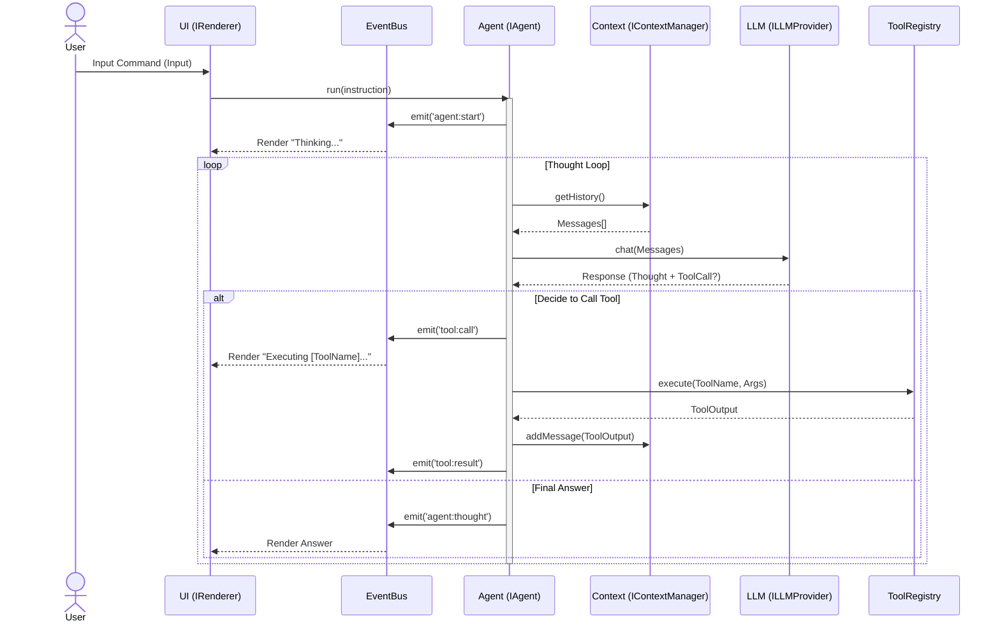

# Architecture Design

> **[English](ARCHITECTURE.md) | [中文版](ARCHITECTURE_zh-CN.md)**

## 1. Core Philosophy
The `aicoding` project aims to build a highly decoupled, plug-and-play terminal AI coding agent.
Every line of code should adhere to the **Dependency Inversion Principle (DIP)** and **Interface Segregation Principle (ISP)**.

### Client/Server Mentality
Although this is a local CLI tool, we adopt a C/S metaphor in module design:
- **Client (UI Layer)**: `src/ui`. Responsible for rendering and receiving input, containing no business logic. It subscribes to state changes via `EventBus`.
- **Server (Core Layer)**: `src/agent`. Responsible for reasoning and loop scheduling. It does not know if the UI is a console or a Web page.
- **Infrastructure (Infra Layer)**: `src/llm`, `src/tools`, `src/fs`. Concrete implementation details (e.g., calling OpenAI or reading/writing local files).

## 2. Data Flow
After user input is captured by the UI, it is passed to the Agent. The Agent does not directly manipulate the DOM or Console but instead emits events to inform the UI what to display.

## 3. Module Responsibilities

| Module | Core Interface | Responsibility | Dependency Direction |
| :--- | :--- | :--- | :--- |
| **Type Definitions** | `src/types/*.ts` | Defines contracts. The guiding light for all modules. | No Dependencies (Base) |
| **Infrastructure** | `ILLMProvider`, `IWorkspace` | Implements concrete IO operations (e.g., OpenAI API, file I/O). | Depends on Types |
| **Logic Core** | `IAgent`, `IContextManager` | Core business logic. Orchestrates LLM, tools, and state. | Depends on Types (Interface only) |
| **Presentation** | `IRenderer` | Converts internal events into user-readable UI (CLI/TUI). | Depends on Types, Events |

## 4. Extensibility
- **Adding a New Model**: Simply implement `ILLMProvider`.
- **Adding a New Tool**: Implement `ITool` interface and register via `IToolRegistry.register()`. The Agent automatically perceives it.
- **Changing UI**: As long as `IRenderer` is implemented, you can easily switch from Terminal to VSCode Webview.

## 5. Directory Structure
Adhere to the following directory organization to maintain a clean architecture:
- `src/`: Source code.
  - `src/types/`: Interface definitions (Contracts).
  - `src/core/`: Business logic (Agent, LLM abstraction).
  - `src/tools/`: Tool implementations. **DO NOT put test files here.**
  - `src/infrastructure/`: Concrete implementations (FS, specific LLMs).
- `test/`: **All test files must reside here.**
  - Naming convention: `[Component].test.ts`.
  - Tests should mirror `src/` structure where possible, or be flat if simple.
- `docs/`: Documentation.
